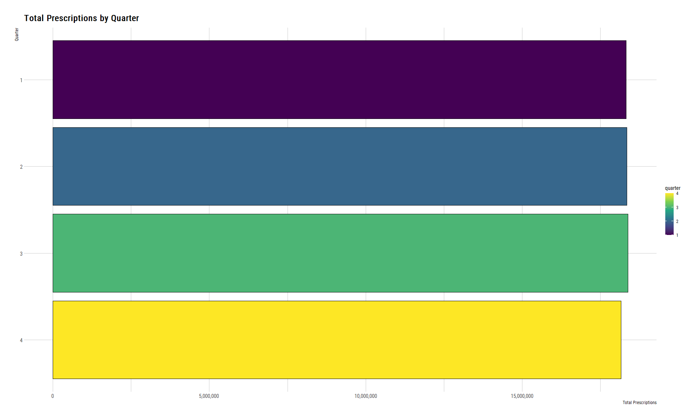
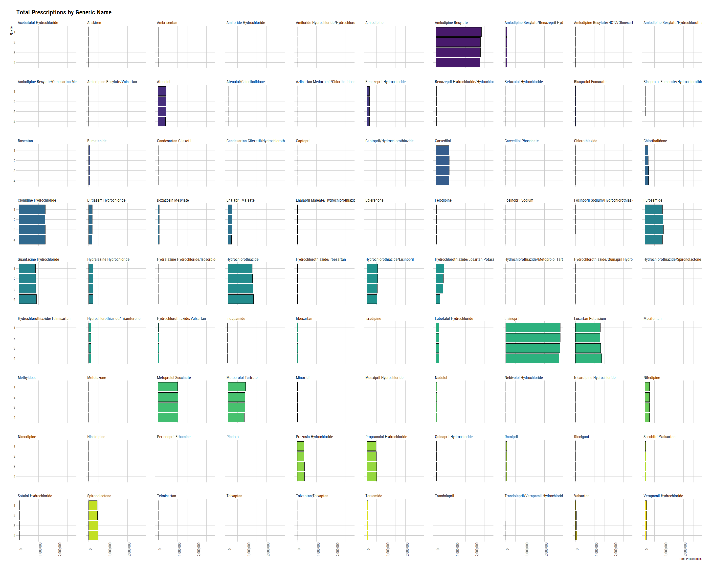
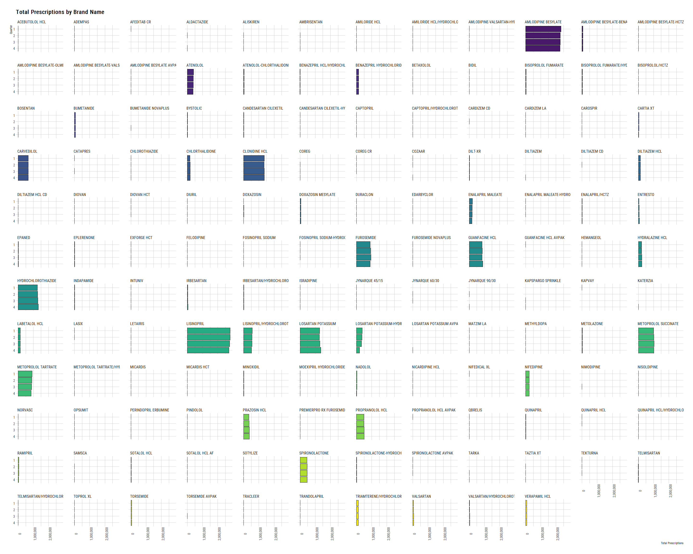

SDUD Antihypertensives 2019
================
Michael Quinn Maguire, MS
2/9/2022

## Packages used

``` r
library(tidyverse)
library(data.table)
library(ggplot2)
library(readxl)
library(hrbrthemes)
```

## Read in antihypertensive NDC file from EM.

``` r
ah <- readxl::read_xlsx(path = "./data/raw/ndc_antihtn.xlsx") |>
  janitor::clean_names() |>
  select(gennme, atc4, atc5, ndc) |>
  arrange(ndc) |>
  as.data.table()

ah
```

    ##                    gennme  atc4    atc5         ndc
    ##     1:            Nadolol C07AA C07AA12 00003020750
    ##     2:            Nadolol C07AA C07AA12 00003020776
    ##     3:            Nadolol C07AA C07AA12 00003020850
    ##     4:            Nadolol C07AA C07AA12 00003023250
    ##     5:            Nadolol C07AA C07AA12 00003023251
    ##    ---                                             
    ## 13093: Losartan Potassium C09CA C09CA01 76439014190
    ## 13094: Losartan Potassium C09CA C09CA01 76439014211
    ## 13095: Losartan Potassium C09CA C09CA01 76439014230
    ## 13096: Losartan Potassium C09CA C09CA01 76439014290
    ## 13097:         Nifedipine C08CA C08CA05 99999000323

## Create a file containing duplicates for transparency.

### First group by all variables and create a counter variable.

``` r
dups <- ah[
  ,
  j = id := 1:.N,
  by = c('gennme', 'atc4', 'atc5', 'ndc')
  ]

dups
```

## Remove duplicates across every field.

``` r
ndNDC <- dups[
  i = (id == 1)
]

ndNDC
```

    ##                    gennme  atc4    atc5         ndc id
    ##     1:            Nadolol C07AA C07AA12 00003020750  1
    ##     2:            Nadolol C07AA C07AA12 00003020776  1
    ##     3:            Nadolol C07AA C07AA12 00003020850  1
    ##     4:            Nadolol C07AA C07AA12 00003023250  1
    ##     5:            Nadolol C07AA C07AA12 00003023251  1
    ##    ---                                                
    ## 11095: Losartan Potassium C09CA C09CA01 76439014190  1
    ## 11096: Losartan Potassium C09CA C09CA01 76439014211  1
    ## 11097: Losartan Potassium C09CA C09CA01 76439014230  1
    ## 11098: Losartan Potassium C09CA C09CA01 76439014290  1
    ## 11099:         Nifedipine C08CA C08CA05 99999000323  1

## Dump the duplicates into one file.

``` r
dupNDC <-
  dups[
    i = (id > 1)
  ]

dupNDC
```

    ##                               gennme  atc4    atc5         ndc id
    ##    1:    Bendroflumethiazide/Nadolol C07BA C07BA12 00003028350  2
    ##    2:    Bendroflumethiazide/Nadolol C07BA C07BA12 00003028450  2
    ##    3:  Captopril/Hydrochlorothiazide C09BA C09BA01 00003033850  2
    ##    4:  Captopril/Hydrochlorothiazide C09BA C09BA01 00003034950  2
    ##    5:  Captopril/Hydrochlorothiazide C09BA C09BA01 00003038450  2
    ##   ---                                                            
    ## 1994: Hydrochlorothiazide/Lisinopril C09BA C09BA03 76282044705  2
    ## 1995: Hydrochlorothiazide/Lisinopril C09BA C09BA03 76282044710  2
    ## 1996: Hydrochlorothiazide/Lisinopril C09BA C09BA03 76282044790  2
    ## 1997: Hydrochlorothiazide/Lisinopril C09BA C09BA03 76282044805  2
    ## 1998: Hydrochlorothiazide/Lisinopril C09BA C09BA03 76282044810  2

## Read in SDUD file. `file_location` is hidden.

``` r
sdud <- fread(
  file_location,
  colClasses = c("proper_ndc" = "character")
  )

sdud
```

    ##            proper_ndc utilization.type year quarter state suppression numberrx
    ##        1: 00002010102             FFSU 2013       4    TN           T        0
    ##        2: 00002010102             FFSU 2014       1    TN           T        0
    ##        3: 00002010102             MCOU 2019       4    TN           T        0
    ##        4: 00002010102             FFSU 2019       4    TN           T        0
    ##        5: 00002010102             MCOU 2019       1    TN           T        0
    ##       ---                                                                     
    ## 66791298: 99207086508             FFSU 2007       3    IL           T        0
    ## 66791299: 99207086508             FFSU 2007       3    NE           T        0
    ## 66791300: 99207086508             FFSU 2007       3    KY           T        0
    ## 66791301: 99207086508             FFSU 2007       1    KY           T        0
    ## 66791302: 99207086508             FFSU 2009       1    SC           T        0
    ##           seqidall seqidndc deaclas generid maintin prodcat siglsrc genind
    ##        1: 33435948   100748       7  999999       3       8       N      6
    ##        2: 36334109   100748       7  999999       3       8       N      6
    ##        3: 57741777   100748       7  999999       3       8       N      6
    ##        4: 57777677   100748       7  999999       3       8       N      6
    ##        5: 61976886   100748       7  999999       3       8       N      6
    ##       ---                                                                 
    ## 66791298: 16529953    55094       7  117166       4       7       N      6
    ## 66791299: 16586913    55094       7  117166       4       7       N      6
    ## 66791300: 16674808    55094       7  117166       4       7       N      6
    ## 66791301: 16909363    55094       7  117166       4       7       N      6
    ## 66791302: 21139053    55094       7  117166       4       7       N      6
    ##           desidrg mastfrm pkqtycd thercls thergrp pksize    therdtl
    ##        1:       N     ECT      EA     101      13    100 4004010030
    ##        2:       N     ECT      EA     101      13    100 4004010030
    ##        3:       N     ECT      EA     101      13    100 4004010030
    ##        4:       N     ECT      EA     101      13    100 4004010030
    ##        5:       N     ECT      EA     101      13    100 4004010030
    ##       ---                                                          
    ## 66791298:       N     SHA      EA     201      26      1 8432010030
    ## 66791299:       N     SHA      EA     201      26      1 8432010030
    ## 66791300:       N     SHA      EA     201      26      1 8432010030
    ## 66791301:       N     SHA      EA     201      26      1 8432010030
    ## 66791302:       N     SHA      EA     201      26      1 8432010030
    ##                          gnindds        metsize         maintds strngth
    ##        1: Over the counter (OTC)       EA 00100 Primarily acute  7.5 GR
    ##        2: Over the counter (OTC)       EA 00100 Primarily acute  7.5 GR
    ##        3: Over the counter (OTC)       EA 00100 Primarily acute  7.5 GR
    ##        4: Over the counter (OTC)       EA 00100 Primarily acute  7.5 GR
    ##        5: Over the counter (OTC)       EA 00100 Primarily acute  7.5 GR
    ##       ---                                                              
    ## 66791298: Over the counter (OTC) 000236.0000 ML  ~Missing/Other      5%
    ## 66791299: Over the counter (OTC) 000236.0000 ML  ~Missing/Other      5%
    ## 66791300: Over the counter (OTC) 000236.0000 ML  ~Missing/Other      5%
    ## 66791301: Over the counter (OTC) 000236.0000 ML  ~Missing/Other      5%
    ## 66791302: Over the counter (OTC) 000236.0000 ML  ~Missing/Other      5%
    ##               prdctds                   thrdtds                mstfmds
    ##        1: OTC/Generic Ammonium Chloride & Comb. Tablet, Enteric Coated
    ##        2: OTC/Generic Ammonium Chloride & Comb. Tablet, Enteric Coated
    ##        3: OTC/Generic Ammonium Chloride & Comb. Tablet, Enteric Coated
    ##        4: OTC/Generic Ammonium Chloride & Comb. Tablet, Enteric Coated
    ##        5: OTC/Generic Ammonium Chloride & Comb. Tablet, Enteric Coated
    ##       ---                                                             
    ## 66791298:   OTC/Trade     Coal Tar & Comb., S/M                Shampoo
    ## 66791299:   OTC/Trade     Coal Tar & Comb., S/M                Shampoo
    ## 66791300:   OTC/Trade     Coal Tar & Comb., S/M                Shampoo
    ## 66791301:   OTC/Trade     Coal Tar & Comb., S/M                Shampoo
    ## 66791302:   OTC/Trade     Coal Tar & Comb., S/M                Shampoo
    ##                                  thrclds                      thrgrds deaclds
    ##        1:         Acidifying Agents, NEC Electrolytic, Caloric, Water     OTC
    ##        2:         Acidifying Agents, NEC Electrolytic, Caloric, Water     OTC
    ##        3:         Acidifying Agents, NEC Electrolytic, Caloric, Water     OTC
    ##        4:         Acidifying Agents, NEC Electrolytic, Caloric, Water     OTC
    ##        5:         Acidifying Agents, NEC Electrolytic, Caloric, Water     OTC
    ##       ---                                                                    
    ## 66791298: Keratoplastic Agents S/MM, NEC       Skin & Mucous Membrane     OTC
    ## 66791299: Keratoplastic Agents S/MM, NEC       Skin & Mucous Membrane     OTC
    ## 66791300: Keratoplastic Agents S/MM, NEC       Skin & Mucous Membrane     OTC
    ## 66791301: Keratoplastic Agents S/MM, NEC       Skin & Mucous Membrane     OTC
    ## 66791302: Keratoplastic Agents S/MM, NEC       Skin & Mucous Membrane     OTC
    ##                             prodnme            gennme
    ##        1: AMMONIUM CHLORIDE TABLETS Ammonium Chloride
    ##        2: AMMONIUM CHLORIDE TABLETS Ammonium Chloride
    ##        3: AMMONIUM CHLORIDE TABLETS Ammonium Chloride
    ##        4: AMMONIUM CHLORIDE TABLETS Ammonium Chloride
    ##        5: AMMONIUM CHLORIDE TABLETS Ammonium Chloride
    ##       ---                                            
    ## 66791298:  PENTRAX MAXIMUM STRENGTH          Coal Tar
    ## 66791299:  PENTRAX MAXIMUM STRENGTH          Coal Tar
    ## 66791300:  PENTRAX MAXIMUM STRENGTH          Coal Tar
    ## 66791301:  PENTRAX MAXIMUM STRENGTH          Coal Tar
    ## 66791302:  PENTRAX MAXIMUM STRENGTH          Coal Tar

## Extract year of interest and drugs of interest.

``` r
yr <- sdud[
  i = year == 2019 & proper_ndc %in% ndcVec,
  j = .(year, proper_ndc, quarter, state, suppression, numberrx, prodnme, gennme)
]

yr
```

    ##         year  proper_ndc quarter state suppression numberrx            prodnme
    ##      1: 2019 00006001954       1    NC           T        0           PRINIVIL
    ##      2: 2019 00006001954       2    NC           T        0           PRINIVIL
    ##      3: 2019 00006010654       3    RI           T        0           PRINIVIL
    ##      4: 2019 00006010654       1    RI           T        0           PRINIVIL
    ##      5: 2019 00006010654       2    RI           T        0           PRINIVIL
    ##     ---                                                                       
    ## 476891: 2019 76439014290       1    NY           T        0 LOSARTAN POTASSIUM
    ## 476892: 2019 76439014290       1    PA           T        0 LOSARTAN POTASSIUM
    ## 476893: 2019 76439014290       1    MS           T        0 LOSARTAN POTASSIUM
    ## 476894: 2019 76439014290       2    OH           T        0 LOSARTAN POTASSIUM
    ## 476895: 2019 76439014290       3    OH           T        0 LOSARTAN POTASSIUM
    ##                     gennme
    ##      1:         Lisinopril
    ##      2:         Lisinopril
    ##      3:         Lisinopril
    ##      4:         Lisinopril
    ##      5:         Lisinopril
    ##     ---                   
    ## 476891: Losartan Potassium
    ## 476892: Losartan Potassium
    ## 476893: Losartan Potassium
    ## 476894: Losartan Potassium
    ## 476895: Losartan Potassium

## Join back to EM file to get other fields.

``` r
yrSV <- ndNDC[yr, on = .(ndc = proper_ndc)]

yrSV 
```

    ##                     gennme  atc4    atc5         ndc id year quarter state
    ##      1:         Lisinopril C09AA C09AA03 00006001954  1 2019       1    NC
    ##      2:         Lisinopril C09AA C09AA03 00006001954  1 2019       2    NC
    ##      3:         Lisinopril C09AA C09AA03 00006010654  1 2019       3    RI
    ##      4:         Lisinopril C09AA C09AA03 00006010654  1 2019       1    RI
    ##      5:         Lisinopril C09AA C09AA03 00006010654  1 2019       2    RI
    ##     ---                                                                   
    ## 476891: Losartan Potassium C09CA C09CA01 76439014290  1 2019       1    NY
    ## 476892: Losartan Potassium C09CA C09CA01 76439014290  1 2019       1    PA
    ## 476893: Losartan Potassium C09CA C09CA01 76439014290  1 2019       1    MS
    ## 476894: Losartan Potassium C09CA C09CA01 76439014290  1 2019       2    OH
    ## 476895: Losartan Potassium C09CA C09CA01 76439014290  1 2019       3    OH
    ##         suppression numberrx            prodnme           i.gennme
    ##      1:           T        0           PRINIVIL         Lisinopril
    ##      2:           T        0           PRINIVIL         Lisinopril
    ##      3:           T        0           PRINIVIL         Lisinopril
    ##      4:           T        0           PRINIVIL         Lisinopril
    ##      5:           T        0           PRINIVIL         Lisinopril
    ##     ---                                                           
    ## 476891:           T        0 LOSARTAN POTASSIUM Losartan Potassium
    ## 476892:           T        0 LOSARTAN POTASSIUM Losartan Potassium
    ## 476893:           T        0 LOSARTAN POTASSIUM Losartan Potassium
    ## 476894:           T        0 LOSARTAN POTASSIUM Losartan Potassium
    ## 476895:           T        0 LOSARTAN POTASSIUM Losartan Potassium

## Checking to make sure years and quarters of interest are included.

``` r
unique(
  yrSV[, c('quarter', 'year')],
  by = c('quarter', 'year')
  )
```

    ##    quarter year
    ## 1:       1 2019
    ## 2:       2 2019
    ## 3:       3 2019
    ## 4:       4 2019

## Begin aggregations.

> Note: This represents the number of prescriptions by `year`,
> `quarter`, and `suppression`.

`Suppression` is a T/F field representing whether there were drug counts
less than 11 for a given aggregation.

Traditionally, JHC would conduct sensitivity analyses by adding 11 to
the suppressed value and re-aggregating.

``` r
drugOverall <- yrSV[
  i = ,
  j = .(totalRX = sum(numberrx)),
  by = c('year', 'quarter', 'suppression')
]

setorder(drugOverall, year, quarter, suppression)

drugOverall
```

    ##    year quarter suppression  totalRX
    ## 1: 2019       1           F 18314619
    ## 2: 2019       1           T        0
    ## 3: 2019       2           F 18344737
    ## 4: 2019       2           T        0
    ## 5: 2019       3           F 18377370
    ## 6: 2019       3           T        0
    ## 7: 2019       4           F 18159197
    ## 8: 2019       4           T        0

## Aggregate by generic name.

``` r
drugOverallGeneric <- yrSV[
  i = ,
  j = .(totalRX = sum(numberrx)),
  by = c('year', 'quarter', 'suppression', 'gennme', 'atc4', 'atc5')
]

setorder(drugOverallGeneric, year, quarter, gennme, suppression)

drugOverallGeneric
```

    ##      year quarter suppression                        gennme  atc4    atc5
    ##   1: 2019       1           F      Acebutolol Hydrochloride C07AB C07AB04
    ##   2: 2019       1           T      Acebutolol Hydrochloride C07AB C07AB04
    ##   3: 2019       1           F                     Aliskiren C09XA C09XA02
    ##   4: 2019       1           T                     Aliskiren C09XA C09XA02
    ##   5: 2019       1           T Aliskiren/Hydrochlorothiazide C09XA C09XA52
    ##  ---                                                                     
    ## 749: 2019       4           T                   Triamterene C03DB C03DB02
    ## 750: 2019       4           F                     Valsartan C09CA C09CA03
    ## 751: 2019       4           T                     Valsartan C09CA C09CA03
    ## 752: 2019       4           F       Verapamil Hydrochloride C08DA C08DA01
    ## 753: 2019       4           T       Verapamil Hydrochloride C08DA C08DA01
    ##      totalRX
    ##   1:    1044
    ##   2:       0
    ##   3:     226
    ##   4:       0
    ##   5:       0
    ##  ---        
    ## 749:       0
    ## 750:   70013
    ## 751:       0
    ## 752:   81774
    ## 753:       0

## Break down by brand name.

``` r
drugOverallGenericBrand <- yrSV[
  i = ,
  j = .(totalRX = sum(numberrx)),
  by = c('year', 'quarter', 'suppression', 'gennme', 'prodnme', 'atc4', 'atc5')
]

setorder(drugOverallGenericBrand, year, quarter, gennme, prodnme, suppression)

drugOverallGenericBrand
```

    ##       year quarter suppression                   gennme                prodnme
    ##    1: 2019       1           F Acebutolol Hydrochloride         ACEBUTOLOL HCL
    ##    2: 2019       1           T Acebutolol Hydrochloride         ACEBUTOLOL HCL
    ##    3: 2019       1           T Acebutolol Hydrochloride   ACEBUTOLOL HCL AVPAK
    ##    4: 2019       1           T                Aliskiren              ALISKIREN
    ##    5: 2019       1           F                Aliskiren               TEKTURNA
    ##   ---                                                                         
    ## 1352: 2019       4           F  Verapamil Hydrochloride          VERAPAMIL HCL
    ## 1353: 2019       4           T  Verapamil Hydrochloride          VERAPAMIL HCL
    ## 1354: 2019       4           T  Verapamil Hydrochloride VERAPAMIL HCL NOVAPLUS
    ## 1355: 2019       4           T  Verapamil Hydrochloride                VERELAN
    ## 1356: 2019       4           T  Verapamil Hydrochloride             VERELAN PM
    ##        atc4    atc5 totalRX
    ##    1: C07AB C07AB04    1044
    ##    2: C07AB C07AB04       0
    ##    3: C07AB C07AB04       0
    ##    4: C09XA C09XA02       0
    ##    5: C09XA C09XA02     226
    ##   ---                      
    ## 1352: C08DA C08DA01   81774
    ## 1353: C08DA C08DA01       0
    ## 1354: C08DA C08DA01       0
    ## 1355: C08DA C08DA01       0
    ## 1356: C08DA C08DA01       0

## Aggregations by State

``` r
drugAggState <- yr[
  i = ,
  j = .(totalRX = sum(numberrx)),
  by = c('year', 'state', 'quarter', 'suppression')
]

setorder(drugAggState, year, state, quarter, suppression)

drugAggState
```

    ##      year state quarter suppression totalRX
    ##   1: 2019    AK       1           F   31004
    ##   2: 2019    AK       1           T       0
    ##   3: 2019    AK       2           F   31848
    ##   4: 2019    AK       2           T       0
    ##   5: 2019    AK       3           F   30343
    ##  ---                                       
    ## 404: 2019    WY       2           T       0
    ## 405: 2019    WY       3           F    5079
    ## 406: 2019    WY       3           T       0
    ## 407: 2019    WY       4           F    5394
    ## 408: 2019    WY       4           T       0

## Break down drug counts and generic name by state.

``` r
drugAggStateGeneric <- yr[
  i = ,
  j = .(totalRX = sum(numberrx)),
  by = c('year', 'state', 'quarter', 'gennme', 'suppression')
]

setorder(drugAggStateGeneric, year, state, quarter, gennme, suppression)

drugAggStateGeneric
```

    ##        year state quarter                        gennme suppression totalRX
    ##     1: 2019    AK       1      Acebutolol Hydrochloride           T       0
    ##     2: 2019    AK       1                     Aliskiren           T       0
    ##     3: 2019    AK       1 Aliskiren/Hydrochlorothiazide           T       0
    ##     4: 2019    AK       1                   Ambrisentan           T       0
    ##     5: 2019    AK       1       Amiloride Hydrochloride           F      18
    ##    ---                                                                     
    ## 28126: 2019    WY       4                     Torsemide           T       0
    ## 28127: 2019    WY       4                   Triamterene           T       0
    ## 28128: 2019    WY       4                     Valsartan           T       0
    ## 28129: 2019    WY       4       Verapamil Hydrochloride           F      12
    ## 28130: 2019    WY       4       Verapamil Hydrochloride           T       0

## Break down drug counts and brand name by state

``` r
drugAggStateGenericBrand <- yr[
  i = ,
  j = .(totalRX = sum(numberrx)),
  by = c('year', 'state', 'quarter', 'gennme', 'prodnme', 'suppression')
]

setorder(drugAggStateGenericBrand, year, state, quarter, gennme, prodnme, suppression)

drugAggStateGenericBrand
```

    ##        year state quarter                        gennme        prodnme
    ##     1: 2019    AK       1      Acebutolol Hydrochloride ACEBUTOLOL HCL
    ##     2: 2019    AK       1                     Aliskiren       TEKTURNA
    ##     3: 2019    AK       1 Aliskiren/Hydrochlorothiazide   TEKTURNA HCT
    ##     4: 2019    AK       1                   Ambrisentan       LETAIRIS
    ##     5: 2019    AK       1       Amiloride Hydrochloride  AMILORIDE HCL
    ##    ---                                                                
    ## 36414: 2019    WY       4                     Torsemide      TORSEMIDE
    ## 36415: 2019    WY       4                   Triamterene    TRIAMTERENE
    ## 36416: 2019    WY       4                     Valsartan      VALSARTAN
    ## 36417: 2019    WY       4       Verapamil Hydrochloride  VERAPAMIL HCL
    ## 36418: 2019    WY       4       Verapamil Hydrochloride  VERAPAMIL HCL
    ##        suppression totalRX
    ##     1:           T       0
    ##     2:           T       0
    ##     3:           T       0
    ##     4:           T       0
    ##     5:           F      18
    ##    ---                    
    ## 36414:           T       0
    ## 36415:           T       0
    ## 36416:           T       0
    ## 36417:           F      12
    ## 36418:           T       0

## Produce plots.

> Note: The following plots are limited to the non-state aggregations.
> Please refer to the PDF’s for additional breakdowns by state.

# Drug counts by quarter

``` r
drugOverall |>
  filter(suppression == 'F') |>
    ggplot() +
      geom_col(aes(x = totalRX, y = reorder(as.factor(quarter), desc(quarter)), fill = quarter), color = 'black') +
      scale_x_continuous(labels = scales::comma) +
      theme_ipsum_rc() +
      ggtitle("Total Prescriptions by Quarter") +
      xlab("Total Prescriptions") +
      ylab("Quarter") +
      scale_fill_viridis_c()
```

<!-- -->

# Drug counts by quarter and generic name

``` r
drugOverallGeneric |>
  filter(suppression == 'F') |>
    ggplot() +
      geom_col(aes(x = totalRX, y = reorder(as.factor(quarter), desc(quarter)), fill = gennme), color = 'black') +
      facet_wrap(~gennme) +
      theme_ipsum_rc() +
      xlab("Total Prescriptions") +
      ylab("Quarter") +
      ggtitle("Total Prescriptions by Generic Name") +
      theme(
        legend.position = 'none',
        axis.text.x = element_text(angle = 90)
      ) +
      scale_x_continuous(labels = scales::comma) +
      scale_fill_viridis_d()
```

<!-- -->

# Drug counts by quarter and generic name

``` r
drugOverallGenericBrand |> 
  filter(suppression == 'F') |>
    ggplot() +
      geom_col(aes(x = totalRX, y = reorder(as.factor(quarter), desc(quarter)), fill = prodnme), color = 'black') +
      facet_wrap(~prodnme) +
      theme_ipsum_rc() +
      xlab("Total Prescriptions") +
      ylab("Quarter") +
      ggtitle("Total Prescriptions by Brand Name") +
      theme(
        legend.position = 'none',
        axis.text.x = element_text(angle = 90)
        ) +
      scale_x_continuous(labels = scales::comma) +
      scale_fill_viridis_d()
```

<!-- -->
